<!-- no site/socials on the GitHub profile yet — add a line here like:
[site](https://...) &nbsp;·&nbsp; [linkedin](https://...) &nbsp;·&nbsp; [email](mailto:...) -->

> Finance tooling and automation. Algorithmic trading systems, market data 
> pipelines, and Claude Code skills that turn recurring workflows into repos.

Small, working tools over big unfinished ones — most of what's below shipped 
in a day or two and stayed in use. Currently deep in [algotrading-system](https://github.com/enrico1c/algotrading-system), 
a live 150 EUR strategy portfolio, and a Qt6 finance dashboard.

<samp>python &nbsp; javascript &nbsp; typescript &nbsp; html &nbsp; css</samp>

**[algotrading-system](https://github.com/enrico1c/algotrading-system)** &nbsp;·&nbsp; <samp>python</samp> 
Modular algorithmic trading system — RSI2, Triple RSI, VECM pairs — running a 
live 150 EUR eToro-compatible portfolio on yfinance data.

**[market-chart](https://github.com/enrico1c/market-chart)** &nbsp;·&nbsp; <samp>javascript</samp> 
TradingView-style candlestick charting with dual open data sources: Binance 
and Kraken for crypto, Yahoo Finance for stocks, forex, and indices.

**[global-trade-monitor](https://github.com/enrico1c/global-trade-monitor)** &nbsp;·&nbsp; <samp>javascript</samp> 
Interactive global trade route monitor — sea lanes, air routes, disruptions, 
alternative routing, and monetary impact — built entirely on free open data.

**[auto-skill-factory](https://github.com/enrico1c/auto-skill-factory)** &nbsp;·&nbsp; <samp>claude code skill</samp> 
Detects recurring workflows in a session and auto-generates matching Claude 
Code skills plus their GitHub repos.

Every graphic here is generated, not embedded from anyone else's server. 
`ascii.svg` is a photo pushed through a character ramp by 
[`scripts/make_portrait.py`](scripts/make_portrait.py); the stat graphics and 
these section headings are drawn by [a scheduled action](.github/workflows/stats.yml) 
straight from the GitHub GraphQL API, once a day, committing only what changed.

They animate with SMIL inside the SVG, because GitHub strips scripts from 
READMEs — and since nothing loads from a third party, nothing here can 
rate-limit or go dark. The headings are SVGs for the same reason: GitHub also 
strips CSS, so an image is the only way to put this page's own typeface on them.

The typeface is [JetBrains Mono](scripts/fonts), subset to just the characters 
each graphic draws and inlined as base64. That isn't only for looks: the 
portrait's grid assumes an advance width of exactly 0.600 em, and a viewer whose 
default monospace is narrower would otherwise see it squeezed.

Language totals cover public repositories only. `year.svg` uses the portrait's 
character ramp: `:` `+` `#` `@`, quiet to loud.
